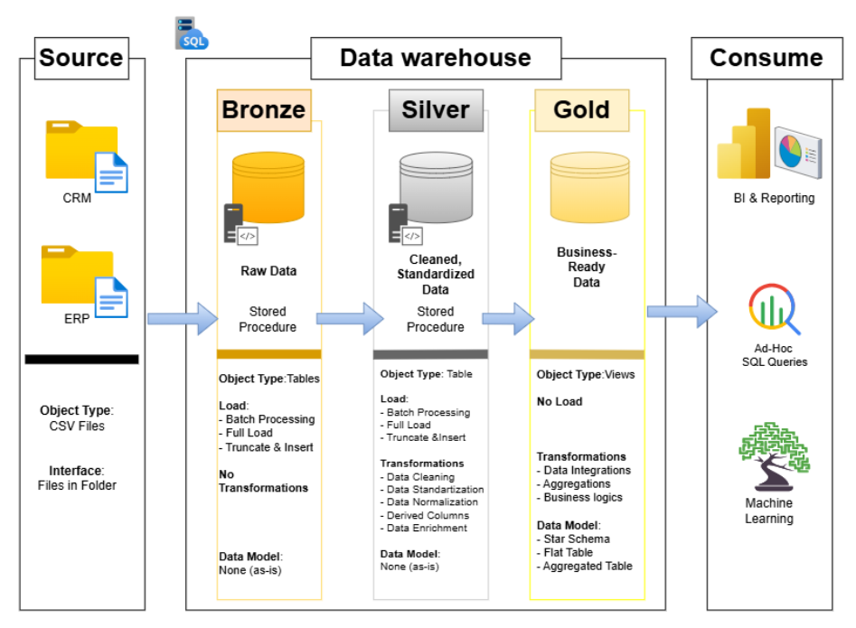

# Data Warehouse and Analytics Project

Welcome to the **Data Warehouse and Analytics Project** 🚀

This project demonstrates a comprehensive data warehousing and analytics solution, from building a data warehouse to generating actionable insights. Designed as a portfolio project, it highlights industry best practices in data engineering and analytics.

---

## 📌 Project Overview

This project involves:

1. **Data Architecture** – Designing a modern data warehouse using the Medallion Architecture with Bronze, Silver, and Gold layers.
2. **ETL Pipelines** – Extracting, transforming, cleansing, and loading data from CRM and ERP source systems.
3. **Data Modelling** – Developing fact and dimension structures optimized for analytical queries.
4. **Analytics & Reporting** – Creating SQL-based analysis to generate actionable business insights.

The project demonstrates the complete journey from **raw source data to business-ready analytical data**.

---

## 🏗️ Data Architecture

The data warehouse follows the **Medallion Architecture**, consisting of three layers:

- **🥉 Bronze Layer** – Stores raw data as-is from CRM and ERP source systems. Data is ingested from CSV files into SQL Server with minimal transformation.
- **🥈 Silver Layer** – Cleans, standardizes, integrates, and enriches the raw data to prepare it for analysis.
- **🥇 Gold Layer** – Contains business-ready data, including dimensional and fact structures designed for reporting and analytics.

### Architecture Flow

**CRM & ERP CSV Files → Bronze → Silver → Gold → BI & Analytics**

The data architecture and flow were designed and documented as part of this project.



For more details, see the **project repository**.

---

## 🚀 Project Requirements

### Building the Data Warehouse (Data Engineering)

#### Objective

Develop a modern data warehouse using SQL Server to consolidate sales data, enabling analytical reporting and informed decision-making.

#### Specifications

- **Data Sources**: Import data from two source systems (ERP and CRM) provided as CSV files.
- **Data Quality**: Cleanse and resolve data quality issues prior to analysis.
- **Integration**: Combine both sources into a single, user-friendly data model designed for analytical queries.
- **Scope**: Focus on the latest dataset only; historization of data is not required.
- **Documentation**: Provide clear documentation of the data model to support both business stakeholders and analytics teams.

---

### BI: Analytics & Reporting (Data Analytics)

#### Objective

Develop SQL-based analytics to deliver detailed insights into:

- **Customer Behavior**
- **Product Performance**
- **Sales Trends**
- **Sales Performance**
- **Key Business Metrics**

These insights empower stakeholders with key business metrics, enabling strategic decision-making.

---
## 🛠️ Technologies & Tools

| Tool / Technology | How it was used |
|---|---|
| **SQL Server Express** | Database engine used to build and run the data warehouse |
| **SQL Server Management Studio (SSMS)** | SQL development, database management, testing, and execution |
| **T-SQL** | ETL processes, data cleansing, transformation, validation, and analytics |
| **Git & GitHub** | Version control, source code management, and project sharing |
| **Draw.io** | Designing and documenting the data warehouse architecture |
| **Notion** | Project planning, defining epics and tasks, and tracking project progress |
| **CSV** | Source data format for the CRM and ERP systems |

---

## 🔗 Important Links

- 📂 **[Datasets](datasets/)** — CRM and ERP source CSV files
- 📚 **[Documentation](docs/)** — Project documentation and supporting materials
- 🏗️ **[Data Architecture](docs/data_architecture_AM.png)** — Data warehouse architecture designed for this project
- 📝 **[Project Planning & Progress](https://app.notion.com/p/Data-Warehouse-Project-3c14caec01b38016b934c70df03031d4?source=copy_link)** — Epics, tasks, milestones, and project progress tracked in Notion
- 🐙 **[GitHub Repository](https://github.com/amacionyte-tech/sql-data-warehouse-project)** — Source code and complete project
- 💼 **[LinkedIn](https://www.linkedin.com/in/agne-macionyte/)** — Feel free to connect!

---

## 📁 Repository Structure

```text
sql-data-warehouse-project/
│
├── datasets/
│   ├── source_crm/
│   │   ├── cust_info.csv
│   │   ├── prd_info.csv
│   │   └── sales_details.csv
│   │
│   └── source_erp/
│       ├── cust_az12.csv
│       ├── loc_a101.csv
│       └── px_cat_g1v2.csv
│
├── docs/
│   └── data_architecture_AM.png
│
├── scripts/
│   ├── bronze/
│   │   ├── ddl_bronze.sql
│   │   └── proc_load_bronze.sql
│   │
│   ├── silver/
│   │   ├── ddl_silver.sql
│   │   └── proc_load_silver.sql
│   │
│   └── gold/
│       └── ddl_gold.sql
│
├── README.md
└── LICENSE
```

> **Note:** The repository structure may evolve as the project develops.

---

## 🎯 Key Skills Demonstrated

Through this project, I have worked with:

- SQL development
- Data warehouse architecture
- Medallion Architecture
- ETL / ELT processes
- Stored procedures
- Data cleansing and transformation
- Data quality validation
- CRM and ERP data integration
- Fact and dimension modelling
- Analytical SQL
- Data-driven business analysis
- Git and GitHub

---

## 🔐 License

This project is licensed under the [MIT License](LICENSE). You are free to use, modify, and share this project with proper attribution.

## 🌟 About Me

Hi there! I'm **Agne Macionyte**, an HR & payroll professional with a background in project management, currently expanding my skills in SQL, data analytics, and data warehousing. This project is part of my journey into the data world, where I'm combining my existing experience in business processes and project management with new technical skills to build practical, data-driven solutions.

I'm passionate about continuous learning and enjoy turning complex processes and data into something structured, understandable, and useful. 🚀

I'm always learning, experimenting, and building — and I'm excited to continue growing in the data space.

**Let's keep in touch! 🤝**

Feel free to connect with me on **LinkedIn** and say hello. I'd be happy to connect with people interested in data, analytics, SQL, technology, or career transitions into the data world.

[Connect with me on LinkedIn](https://www.linkedin.com/in/agne-macionyte/)
